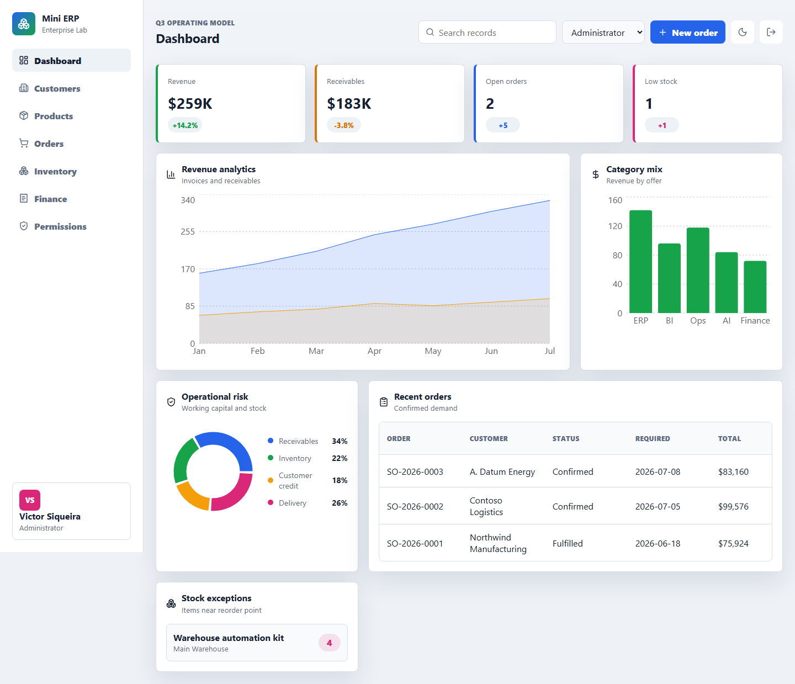
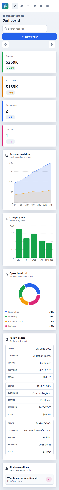
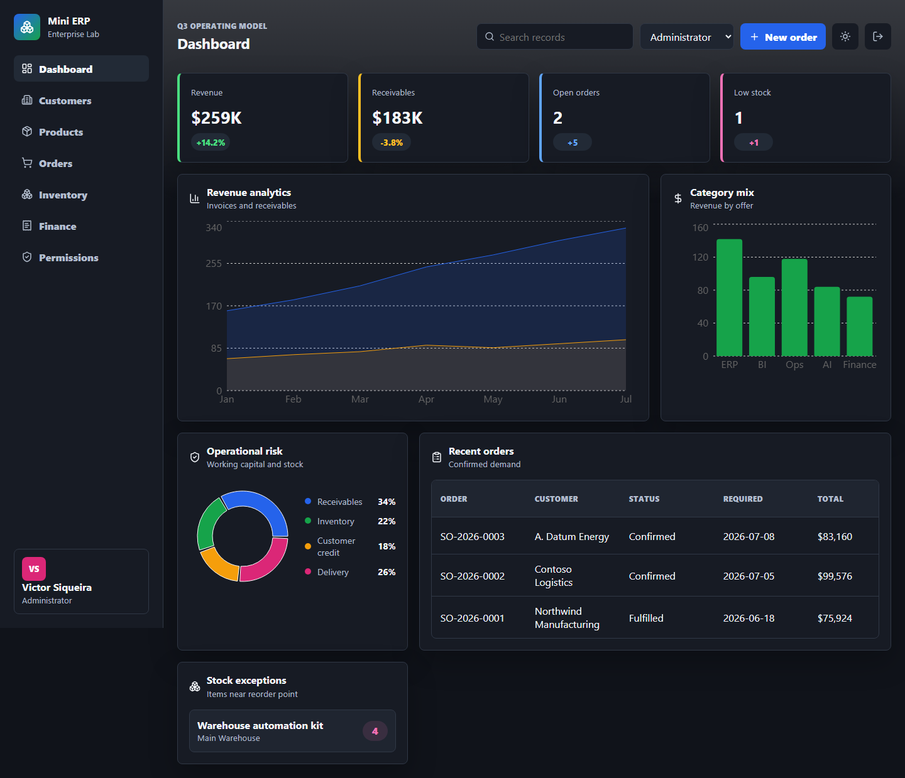

# WareFlow

[](https://github.com/F0zzi4/wareflow/actions/workflows/ci.yml)


**WareFlow** is a full-stack management platform designed to support the registration, tracking and management of goods and business operations.

The platform provides a centralized environment for managing products, inventory, customers, orders, invoices and financial operations, with a particular focus on **goods movements and inventory flows**.

Built with **.NET, React, TypeScript, PostgreSQL and Docker**, WareFlow is designed as a modular foundation that can evolve to support the specific operational and accounting requirements of real-world organizations.

> This project is based on the open-source [Mini ERP](https://github.com/vsiqueiravh-cell/mini-erp) project. See [`NOTICE`](NOTICE) for attribution and additional information.

## Preview



| Mobile                                                                   | Dark mode                                                               |
| ------------------------------------------------------------------------ | ----------------------------------------------------------------------- |
|  |  |

## Architecture

```text
wareflow/
  backend/
    src/
      MiniErp.Api/           ASP.NET Core API, EF Core, JWT, RBAC
    tests/
      MiniErp.Api.Tests/     Service and business rule tests

  frontend/                  React, TypeScript, Recharts, Vitest

  docker-compose.yml         PostgreSQL, API and frontend runtime
  NOTICE                     Original project attribution
  LICENSE                    Project license
```

The current implementation is organized around a REST API and a React-based web application:

```text
┌─────────────────────┐
│      WareFlow UI    │
│ React + TypeScript  │
└──────────┬──────────┘
           │ REST / JSON
           ▼
┌─────────────────────┐
│    WareFlow API     │
│ ASP.NET Core + EF   │
│ JWT + RBAC          │
└──────────┬──────────┘
           │
           ▼
┌─────────────────────┐
│     PostgreSQL      │
└─────────────────────┘
```

## Core Areas

### 📦 Goods & Inventory

* Product catalog.
* Inventory positions.
* Stock adjustments.
* Inventory reservation.
* Tracking of goods-related operations.
* Foundation for future goods movement workflows.

### 🛒 Orders

* Sales order creation.
* Stock reservation associated with orders.
* Order lifecycle management.
* Customer association.

### 👥 Customers

* Customer portfolio.
* Customer status management.
* Customer-related business information.

### 🧾 Invoicing & Finance

* Invoice generation.
* Invoice portfolio.
* Payment and settlement tracking.
* Foundation for extending accounting workflows.

### 📊 Dashboard

* Revenue overview.
* Receivables.
* Inventory risk indicators.
* Recent orders.
* Operational analytics.

### 🔐 Access Control

* JWT-based authentication.
* Role-based access control.
* Administrator, Manager and Analyst roles.
* API-level authorization policies.

## Features

* Full-stack web application.
* RESTful ASP.NET Core API.
* React + TypeScript frontend.
* PostgreSQL persistence through Entity Framework Core.
* JWT authentication.
* Role-based authorization.
* Product and inventory management.
* Stock reservations and adjustments.
* Customer management.
* Sales orders.
* Invoice and finance workflows.
* Operational dashboard.
* Docker Compose development environment.
* Backend and frontend automated tests.
* GitHub Actions CI.
* Vulnerability auditing for backend dependencies.

## Roadmap

WareFlow is intended to evolve from its current foundation into a broader goods and business management platform.

Planned areas include:

* [ ] Goods movement management.
* [ ] Incoming and outgoing stock movements.
* [ ] Transfer between warehouses or storage locations.
* [ ] Movement history and audit trail.
* [ ] Multiple warehouses and storage locations.
* [ ] Suppliers and purchasing workflows.
* [ ] More advanced inventory management.
* [ ] Accounting and financial workflows.
* [ ] Document management.
* [ ] Advanced reporting and analytics.
* [ ] Italian business and accounting requirements.
* [ ] Improved role and permission management.

The roadmap is intentionally incremental: existing workflows will be extended while keeping the application modular and maintainable.

## Demo Accounts

All demo accounts use the password:

```text
enterprise-demo
```

| User                                                                    | Role          |
| ----------------------------------------------------------------------- | ------------- |
| [victor.siqueira@enterprise.dev](mailto:victor.siqueira@enterprise.dev) | Administrator |
| [marina.costa@enterprise.dev](mailto:marina.costa@enterprise.dev)       | Manager       |
| [rafael.lima@enterprise.dev](mailto:rafael.lima@enterprise.dev)         | Analyst       |

> Demo data is fictional and intended exclusively for development and demonstration purposes.

## Local Development

### Backend

```bash
cd backend
dotnet restore MiniErp.slnx
dotnet run --project src/MiniErp.Api
```

### Frontend

```bash
cd frontend
npm install
npm run dev
```

### Docker

The complete development environment can be started with:

```bash
docker compose up --build
```

Default services:

| Service    | Address                 |
| ---------- | ----------------------- |
| Frontend   | `http://localhost:5174` |
| API        | `http://localhost:5080` |
| PostgreSQL | `localhost:5432`        |

## Quality Gates

### Backend

```bash
cd backend

dotnet build MiniErp.slnx
dotnet test MiniErp.slnx
dotnet list MiniErp.slnx package --vulnerable --include-transitive
```

### Frontend

```bash
cd frontend

npm run lint
npm run build
npm test
npm run test:visual
```

## API

The current API exposes the following main resources:

| Method   | Path                                   | Purpose                             |
| -------- | -------------------------------------- | ----------------------------------- |
| POST     | `/api/auth/login`                      | Authenticate a user and issue a JWT |
| GET      | `/api/dashboard`                       | Retrieve dashboard metrics          |
| GET/POST | `/api/customers`                       | Manage customers                    |
| PATCH    | `/api/customers/{id}/status`           | Update customer status              |
| GET/POST | `/api/products`                        | Manage products                     |
| GET/POST | `/api/orders`                          | Manage sales orders                 |
| GET      | `/api/inventory`                       | Retrieve inventory positions        |
| POST     | `/api/inventory/adjustments`           | Apply inventory adjustments         |
| GET      | `/api/finance/invoices`                | Retrieve invoices                   |
| POST     | `/api/finance/invoices/{id}/mark-paid` | Mark an invoice as paid             |

The API surface will evolve as additional goods management and accounting workflows are introduced.

## Technology Stack

| Area             | Technology            |
| ---------------- | --------------------- |
| Backend          | ASP.NET Core / .NET   |
| ORM              | Entity Framework Core |
| Authentication   | JWT                   |
| Authorization    | RBAC                  |
| Frontend         | React                 |
| Language         | TypeScript            |
| Database         | PostgreSQL            |
| Charts           | Recharts              |
| Testing          | xUnit / Vitest        |
| Containerization | Docker                |
| CI/CD            | GitHub Actions        |

## Project Structure

```text
wareflow/
├── backend/
│   ├── src/
│   │   └── MiniErp.Api/
│   └── tests/
│       └── MiniErp.Api.Tests/
│
├── frontend/
│
├── docs/
│   └── assets/
│       └── screenshots/
│
├── docker-compose.yml
├── LICENSE
├── NOTICE
└── README.md
```

> The internal project structure will progressively be renamed from the original foundation as the application domain is refactored toward WareFlow.

## License

WareFlow is released under the **MIT License**.

See [`LICENSE`](LICENSE) for the complete license text and [`NOTICE`](NOTICE) for attribution regarding the original project on which WareFlow is based.

## Status

**Early development**

WareFlow is currently being evolved from its initial ERP foundation toward a dedicated platform for **goods management, inventory movements and business operations**.

The current functionality should therefore be considered a foundation rather than a complete production ERP or accounting system.
